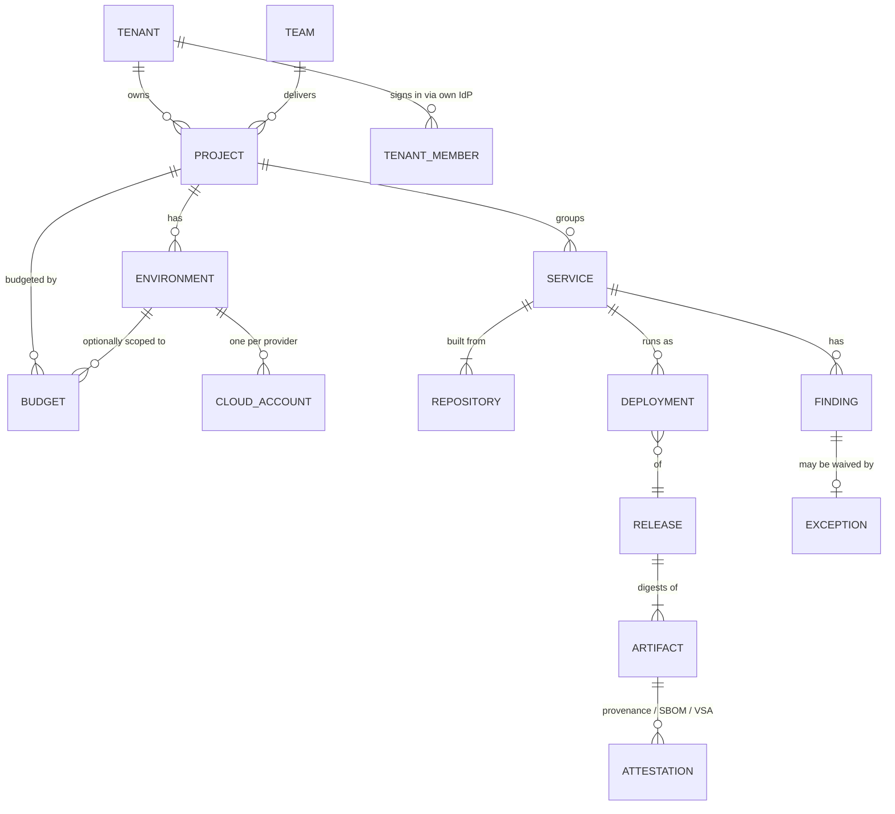
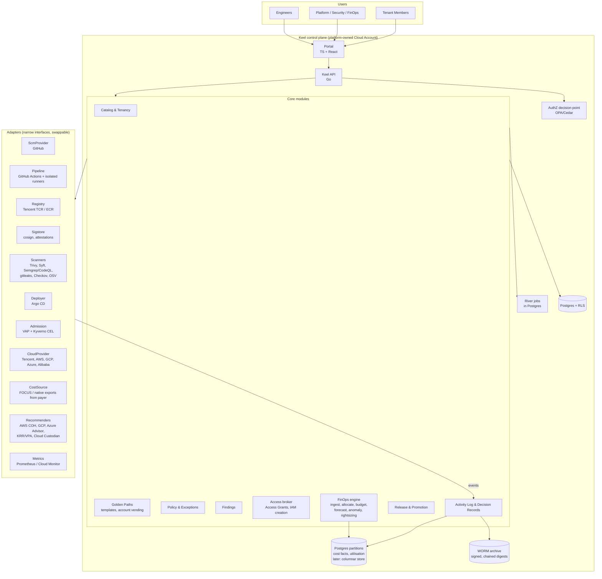
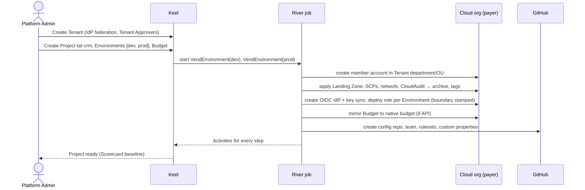
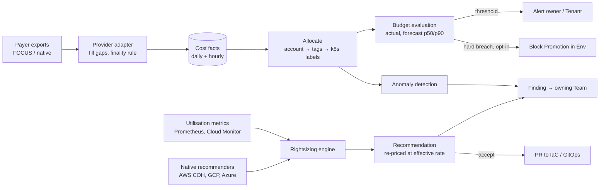

# Keel — Product & Architecture Design

Status: **implemented through M6** · 2026-10-08 · Glossary: [CONTEXT.md](../CONTEXT.md) ·
Decisions: [adr/](./adr/) · History: [ACTIVITY-LOG.md](./ACTIVITY-LOG.md) ·
Evidence: [research/](./research/)

Terms in **Bold Capitals** are defined in the glossary and used strictly.

---

## 1. What Keel is

A multi-tenant DevSecOps platform that gives every Team one paved road from code
to production, and gives every Tenant (client organisation) one place to see
what was built, what it costs and whether it is secure.

It covers seven jobs:

| # | Job | One-line outcome |
|---|---|---|
| 1 | **Tenancy & Catalog** | Every Repository, Service, Cloud Account and dollar has an owner. |
| 2 | **Repository management** | New repos are born governed: owner, rulesets, templates, secrets scanning. |
| 3 | **CI/CD & supply chain** | Every Artifact is built in isolation, signed, has an SBOM, and is verified before it runs. |
| 4 | **Policy & Findings** | One Policy model enforced at PR, Pipeline, admission and cloud; one Findings inbox. |
| 5 | **Access & permission boundaries** | No standing prod access; time-boxed Access Grants; teams self-serve IAM inside a ceiling. |
| 6 | **FinOps** | Budget vs actual vs forecast per Project × Environment, per day/month/year, across clouds; every resource right-sized. |
| 7 | **Record** | Every change is an Activity in one tamper-evident log; every hard decision is a Decision Record. |

### Non-goals (for now)

- Not a CI runner, scanner, GitOps engine or SIEM. Keel orchestrates those
  ([ADR-0003](./adr/0003-compose-best-of-breed-build-only-the-control-plane.md)).
- Not a ticketing system; Keel links to tickets and writes Activities.
- No chargeback to a general ledger in v1 (showback only).
- No runtime threat detection (CNAPP/eBPF) in v1. Findings from such tools can be
  ingested later.

---

## 2. Principles (from the research)

1. **Shift down, not just left.** Put security into the platform so the
   developer's question is "am I on the Golden Path?" (Google safe-coding,
   Netflix Wall-E). [research/03 §8]
2. **Guardrails, not gates.** Central ceilings (Permission Boundaries, SCPs),
   team self-service beneath them. [research/02 §2]
3. **Nothing long-lived.** No long-lived cloud keys in CI, no standing human
   prod access, no mutable tags. [research/01, 02]
4. **Evidence over ceremony.** Recorded peer review + Policy results in the
   Activity Log replace change advisory boards (DORA: CABs don't lower change-fail
   rate). [research/03 §7]
5. **Audit first, then enforce.** Every Policy launches in warn mode with an
   owner and an Exception path with expiry. [research/02 §6]
6. **Payer-first, FOCUS-shaped cost.** One normalised cost model; native schemas
   only fill gaps. [research/03 §6, 04]
7. **Recommend as a PR.** Rightsizing and fixes land as reviewable changes to
   IaC/GitOps, never as silent mutations.
8. **Tenant isolation is a property of the data layer**, not a UI filter.

---

## 3. Tenancy & ownership model



- **Tenant → Project → Environment → Cloud Account** is the spine
  ([ADR-0001](./adr/0001-tenant-is-a-client-organisation.md),
  [ADR-0002](./adr/0002-one-cloud-account-per-project-environment.md)).
- Every row in Keel's datastore carries `tenant_id`; Postgres row-level security
  enforces isolation ([ADR-0014](./adr/0014-keel-implementation-stack.md)).
- The home organisation is a Tenant. Platform operators reach into another
  Tenant only through an **Access Grant**, which shows up in that Tenant's
  Activity Log.
- Catalog descriptors are Backstage-compatible `catalog-info.yaml`
  ([ADR-0004](./adr/0004-own-portal-with-backstage-compatible-catalog.md)).

### Roles (initial)

| Role | Scope | Can |
|---|---|---|
| Platform Admin | all Tenants (via Access Grant) | manage Landing Zones, Guardrails, connectors |
| Security Lead | Tenant or all | own Policies, approve Exceptions |
| FinOps Lead | Tenant or all | set Budgets, approve commitment purchases |
| Team Lead | Team's Projects | approve Access Grants and Promotions to prod, accept Recommendations |
| Engineer | Team's Projects | create Services, request Access Grants, open Promotions |
| Tenant Viewer | own Tenant | read budgets, releases, Findings summaries, reports |
| Tenant Approver | own Tenant | approve prod Promotions/Budgets when the client requires it |

Keel's own authorisation is policy-based (OPA or Cedar), not ad-hoc code
([ADR-0009](./adr/0009-one-policy-model-four-enforcement-points.md)).

---

## 4. Architecture



### Module responsibilities

| Module | Owns | Integrates |
|---|---|---|
| **Catalog & Tenancy** | Tenants, Projects, Teams, Services, Environments, Cloud Accounts, ownership, Scorecards | GitHub (custom properties, CODEOWNERS), cloud orgs, IdPs |
| **Golden Paths** | Templates, account vending, Landing Zones | GitHub templates, Terraform/OpenTofu, cloud org APIs |
| **Policy & Exceptions** | Controls → Policies → Enforcement Points; Exceptions with expiry | Conftest/OPA, VAP, Kyverno, org SCPs, GitHub rulesets |
| **Findings** | One deduped Findings inbox (security, compliance, cost, rightsizing) | Scanners, recommenders, Policy results, VEX |
| **Access broker** | Permission Boundaries, IAM role creation, Access Grants, break-glass audit | Tencent CAM/Organization, AWS IAM/SCP, CIC/Identity Center |
| **Release & Promotion** | Releases, Promotions, Deployment state, VSA issuance | Argo CD, registry, Sigstore |
| **FinOps engine** | Cost facts, allocation, Budgets, Forecasts, Cost Anomalies, Rightsizing Recommendations | Payer exports, native budgets/recommenders, OpenCost, KRR/VPA, Custodian |
| **Activity Log & Decision Records** | Activities (OCSF 6003 in CloudEvents), digests, Decision Record index | CloudAudit, CloudTrail, GitHub audit, K8s audit |

### Deployment of Keel itself

Keel runs in its own platform-owned Cloud Account (Tencent, ap-bangkok first),
on its own TKE cluster, deployed by its own Golden Path. The log archive lives in
a separate platform-owned account whose organisation policy denies deletes.
Keel uses the same Workload Identity, signing and admission rules it imposes on
others.

---

## 5. Key flows

### 5.1 Onboard a Tenant and Project (account vending)



### 5.2 Code → Artifact → Promotion

1. Engineer creates a Service from a Template: repo with `catalog-info.yaml`,
   CODEOWNERS, pinned reusable workflow, Renovate (with minimum release age),
   `docs/decisions/` (MADR), required custom properties.
2. PR: org ruleset requires review + CODEOWNERS + status checks (Conftest on IaC
   and workflows, SAST/SCA diff, secrets). Results become Findings.
3. Merge to main → reusable workflow on an **ephemeral isolated runner** builds;
   a separate signing step (isolated from build steps) obtains the OIDC token,
   produces SLSA provenance + CycloneDX SBOM, signs with Sigstore, pushes to TCR
   as OCI referrers ([ADR-0010](./adr/0010-supply-chain-target-slsa-build-l3.md)).
4. Keel's Release policy verifies builder ID, repo, protected ref, workflow,
   trigger; issues a VSA; creates the **Release**.
5. **Promotion** = PR to the config repo bumping the digest; gated by Policy
   (VSA present, no unexcepted critical Findings, Budget not hard-breached,
   Tenant approval if required). Argo CD reconciles. Admission re-verifies the
   signature and provenance ([ADR-0008](./adr/0008-gitops-promotion-of-immutable-digests.md)).
6. Every step is an Activity; DORA metrics derive from them.

### 5.3 Access Grant

Engineer requests `prod-operator` on `tat-crm/prod` for 2h with a reason →
policy decides (auto-approve for low-risk roles, Team Lead otherwise, Tenant
Approver if the Tenant requires) → Keel creates the time-boxed assignment →
a scheduled River job revokes it → Activities on request, approval, use, revoke.
Break-glass bypasses Keel, alerts on use and requires a post-mortem
([ADR-0006](./adr/0006-keel-is-the-only-creator-of-cloud-identities.md)).

### 5.4 Cost → Budget → Rightsizing



- **Budget views** (the core FinOps screen): per Project and per Project ×
  Environment, toggle Day / Month / Year, showing Budget, Actual Spend (billed
  and effective), Forecast band, variance, and "data final?" status per provider.
- Allocation precedence follows ADR-0011: Cloud Account → tags → Kubernetes
  namespace/labels. Shared platform costs (runners, registry, Keel itself) are
  split by usage.
- Rightsizing defaults follow ADR-0013; Tencent and Kubernetes are covered by
  Keel's own engine from day one, since that is where the current estate lives.

---

## 6. Data shapes (sketch)

Full YAML sketches of `cost_fact`, `budget`, `budget_status` and
`recommendation` are in [research/04 §10](./research/04-multicloud-budgets-and-rightsizing.md#10-implications-for-our-platform).
The Activity record follows the OCSF 6003 mapping table in
[research/02 §8](./research/02-identity-policy-secrets-audit.md#8-audit--activity-logs).

Minimum Activity envelope:

```yaml
specversion: "1.0"            # CloudEvents
id: 01J...                    # ULID
source: keel/promotion        # producing module or adapter
type: keel.promotion.approved
time: 2026-10-06T09:12:03Z
subject: tenant/tat/project/tat-crm/env/prod
data:                         # OCSF API Activity (class_uid 6003)
  tenant_id: tat
  actor: { type: human|pipeline|workload|keel, uid, session: { grant_id, mfa } }
  api: { operation: ApprovePromotion }
  activity_id: 3              # Update
  resources: [{ type: release, uid: rel_..., owner_team: crm }]
  why: { pr: https://github.com/..., reason: "..." }
  status_id: 1                # Success
  status_detail: "policy prod-promotion@v4: allow"
  integrity: { batch: b_..., prev_digest: ... }
```

---

## 7. Security of Keel itself

Keel is a high-value target: it can create IAM roles and approve production
access. Controls:

- Keel's automation identities are the only principals allowed to create IAM;
  they live in a dedicated account, use Workload Identity only, and every call
  is an Activity.
- Two-person rule (Team Lead + Security Lead) for changes to Permission
  Boundaries, organisation SCPs and Keel's own Policies.
- Keel deploys through its own Golden Path (signed, provenance-verified).
- Cross-Tenant isolation is tested in CI (RLS tests, per-endpoint Tenant
  fuzzing) as a release-blocking suite.
- Keel failure must not block break-glass.

---

## 8. Non-functional targets (initial)

| Area | Target |
|---|---|
| Cost data freshness | ≤ provider latency + 2h; finality status visible per provider |
| Budget evaluation | after every ingest; alert ≤ 15 min after evaluation |
| Activity Log | write ≤ 1s p99; digest every hour; retention ≥ 7 years in archive |
| Tenant isolation | zero cross-Tenant reads; tested every build |
| Availability | Portal/API 99.5%; Promotion and Access Grant paths 99.9% (break-glass covers the rest) |
| Scale (year 1) | 20 Tenants, 100 Projects, 300 Cloud Accounts, 5 providers |

---

## 9. Roadmap

Ordered by value given the stated priority (cost) and dependencies. Each
milestone is shippable on the existing Tencent estate before the next starts
(thinnest viable platform). These map to GitHub milestones and epics.

| Milestone | Scope | Why this order |
|---|---|---|
| | **Status 2026-10-07:** M0 ✅ built · M1 ✅ built (real billing connection pending #29) · M2 ✅ built (needs member roles, Prometheus, GitHub token) · M3–M6 not started | |
| **M0 Foundations** | Repo + Keel CI; Tenancy & Catalog (Tenant/Project/Env/Account, import existing Tencent accounts); SSO incl. per-Tenant IdP; Keel authZ; Activity Log v1 (write path, hash chain) | Everything keys off ownership and the log |
| **M1 Cost visibility** | Tencent payer connector (FOCUS + native gap-fill), AWS connector; cost facts; allocation; Budgets (day/month/year per Project × Env); forecast; anomaly alerts; Tenant cost view | Highest stated priority; works on today's estate |
| **M2 Rightsizing & waste** | K8s workload rightsizing (KRR-style on Prometheus); Tencent CVM/DB engine; AWS COH ingest; Custodian idle/orphan; Recommendation → PR; savings tracking | Turns visibility into savings |
| **M3 Golden Path delivery** | Account vending + Landing Zone; GitHub governance as code (rulesets, custom properties); keyless CI (OIDC + Tencent key sync); TCR; Service Templates; Argo CD Promotion | Standardises how new work is born |
| **M4 Supply chain & Policy** | Isolated runners, signing, SBOM, VSA; admission verification; Policy at 4 points; Findings + Exceptions; scanner orchestration; VEX | Needs M3's paved road to attach to |
| **M5 Access** | Permission Boundaries + "Keel creates all IAM"; Access Grants; break-glass drill; secret leak auto-revoke | Needs Catalog + Activity Log; high risk, so after the platform is trusted |
| **M6 Insights & compliance** | DORA 5 metrics from Activities; Scorecards; Decision Record index; SSDF/CRA evidence export; GCP/Azure/Alibaba connectors | Built on data from all earlier milestones |

---

## 10. Open questions

| # | Question | Blocks |
|---|---|---|
| Q1 | ~~GitHub plan~~ decided: GitHub Free for now; Keel reports the protections Free cannot enforce on private repos ([ADR-0016](./adr/0016-github-free-plan-report-not-enforce.md)). | — |
| Q2 | Who owns the Tencent payer UIN (200045645249) and can grant Keel a read-only billing role there? Member accounts return zero. | M1 |
| Q3 | ~~Providers~~ decided: Tencent + AWS in year 1. | — |
| Q4 | ~~Stack~~ decided: Go + Postgres + River ([ADR-0014](./adr/0014-keel-implementation-stack.md)). | — |
| Q5 | ~~Compliance~~ decided: ISO 27001, SOC 2 and PDPA (Thailand); no CAB, ADR-0005's per-Tenant prod approval Policy stays ([ADR-0017](./adr/0017-compliance-frameworks-iso27001-soc2-pdpa.md)). | — |
| Q6 | ~~Client-owned orgs~~ decided: yes, on Tencent, AWS, Azure, GCP and Alibaba; Keel is read-only there ([ADR-0018](./adr/0018-client-owned-organisations-read-only.md)). | — |
| Q7 | ~~Currency~~ decided: per-Tenant (THB or USD), daily FX. | — |
| Q8 | ~~COS object lock~~ decided: the log archive uses AWS S3 Object Lock instead (ADR-0019, #15). | — |

---

## 11. Risks

| Risk | Mitigation |
|---|---|
| Tencent doc/API gaps (static OIDC keys, no forced boundary, FOCUS gaps, intl docs lagging CN) | Verify in a sandbox account early; adapters isolate quirks; Tencent gap table in research/02 |
| Keel becomes a bottleneck for IAM and promotion | High availability on those paths; break-glass; audit-first rollout |
| Scope is huge | Strict milestone order; adopt, don't build ([ADR-0003](./adr/0003-compose-best-of-breed-build-only-the-control-plane.md)) |
| Tag hygiene undermines allocation | Account-per-Environment makes tags secondary; unallocated spend is a KPI |
| Rightsizing causes outages | Recommendations land as PRs, prod needs higher confidence, in-place resize where available, savings tracked against incidents |
